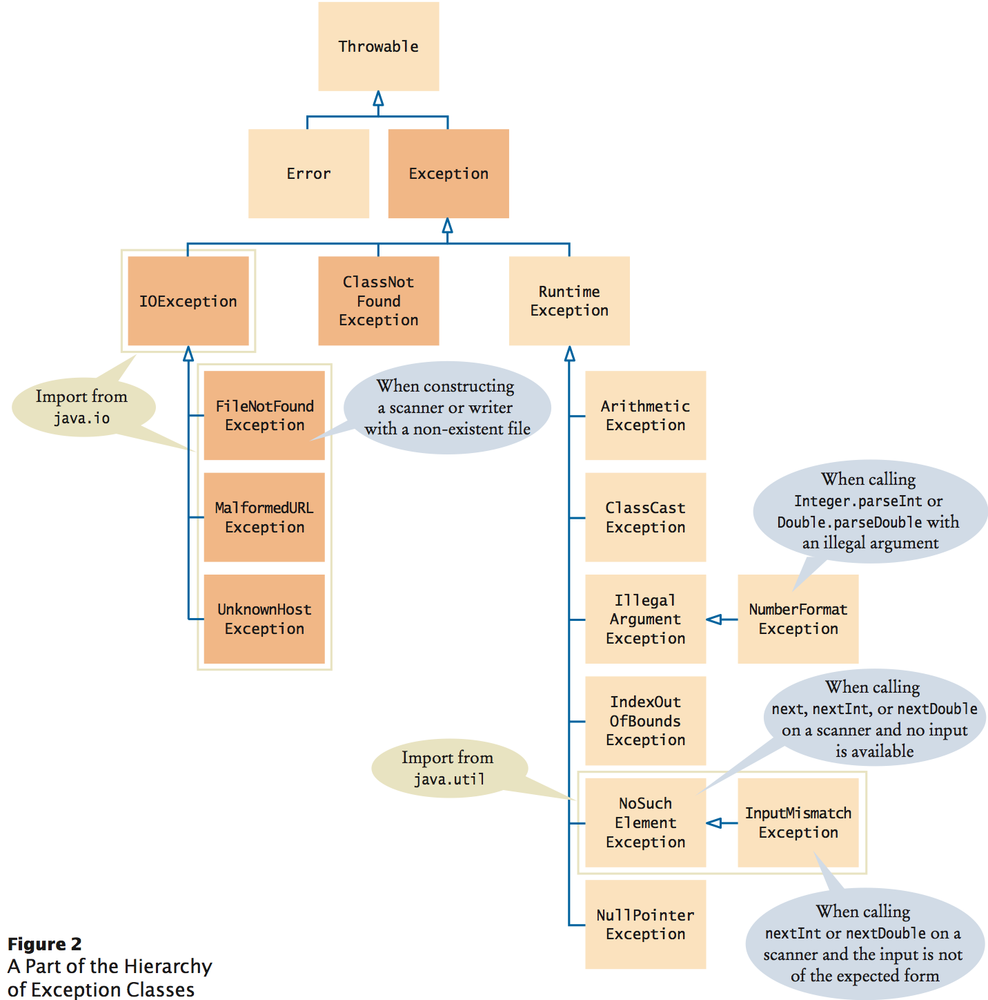

Java Exception
=
The term exception is shorthand for "exceptional event". (Oracle)
"There are two aspects to dealing with program errors:  **detection** and **handling**". 
"In Java, **exception Handling** provides a flexible mechanism for passing control from the point of error detection to a handler that can deal with the error." (Cay . S. H)

---
####Throwing Exceptions

When throw an exception, execution does not continue with the next statement but with an exception handler: 
```
    public void setPID(String pid) {
        if (!validatePID(pid)) {
            // A new exception object is constructed then thrown(with an error message)
            throw new IllegalArgumentException(pid + " is not a valid PID for "
                    + gender + " and " + dateOfBirth);
        }
        this.pid = pid; // Will not executed when the exception is thrown.
    }
```



---

The Three Kinds of Exceptions:
-

1. checked exception
> Checked exceptions are subject to the Catch or Specify Requirement.
> All exceptions are checked exceptions, except for those indicated by
> Error, RuntimeException, and their subclasses.

2. error
>Errors are not subject to the Catch or Specify Requirement.
>Errors are those exceptions indicated by Error and its subclasses.

3. runtime exception
> Runtime exceptions are not subject to the Catch or Specify Requirement.
> Runtime exceptions are those indicated by RuntimeException and its subclasses.

> Errors and runtime exceptions are collectively known as unchecked exceptions.

> Checked exceptions must be explicitly caught or propagated as described in Basic try-catch-finally Exception Handling.
Unchecked exceptions do not have this requirement. They don't have to be caught or declared thrown.

> Checked exceptions in Java extend the java.lang.Exception class.
Unchecked exceptions extend the java.lang.RuntimeException.

####[Read Exception from Oracle][1]
Checked exception:
-
>En checked exception er en subklasse av Exception som ikke samtidig er en subklasse av RuntimeException. En slik Exception må deklareres vha. throws og den kallende metoden må enten håndtere unntaket med try/catch eller deklarere det med throws.

```
public void setDateOfBirth(Date dateOfBirth) throws Exception {
    if (personnumber != null) {
        throw new Exception(
                "Cannot change date of birth after PID has been set");
    }
    this.birth = dateOfBirth;
}
```

Method 1: Use try, catch to deal with "throws Exception":
```
        public void testExceptions1() {
            Person ole = new Person("Male");
                try {
                    ole.setDateOfBirth(new Date(1, 3, 1));
                } catch (Exception e) {
                    System.out.println(e);
                    e.printStackTrace();
                }
        }
```
Method 2: Use "throws Exception" to throw it again, and let others to deal with it.
```
        public void testExceptions2() throws Exception {
            Person kari = new Person("female");
            kari.setDateOfBirth(new Date(1, 1, 1));
        }
        //finally there are two methods again to do the last work:
            // method 1
                public static void main(String[] args) throws Exception {
                    test.testExceptions2();
                }

            // method 2
                public static void main(String[] args) {
                    try {
                        test.testExceptions2();
                    } catch (Exception e) {
                        System.out.println(e);
                        e.printStackTrace();
                    }
                }
```

####Java Exception Hierarchy:


---
Sources:

 - Oracle: [Exceptions][1]
 - Cay S. Horstmann 2014: *Big Java: Early Objects*, 5th Edition
 - NTNU: [TDT4100][2]


  [1]: http://docs.oracle.com/javase/tutorial/essential/exceptions/index.html
  [2]: https://www.ntnu.no/wiki/display/tdt4100/Faginnhold
