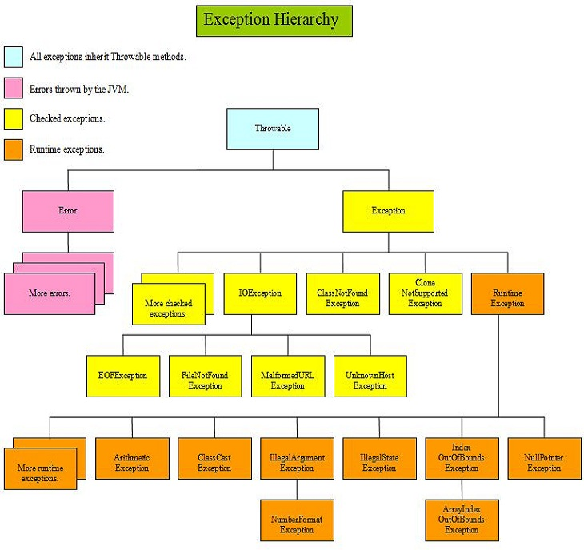

Java Exception
=
The term exception is shorthand for "exceptional event".

####The Three Kinds of Exceptions:

1. checked exception
> Checked exceptions are subject to the Catch or Specify Requirement.
> All exceptions are checked exceptions, except for those indicated by
> Error, RuntimeException, and their subclasses.

2. error
>Errors are not subject to the Catch or Specify Requirement.
>Errors are those exceptions indicated by Error and its subclasses.

3. runtime exception
> Runtime exceptions are not subject to the Catch or Specify Requirement.
> Runtime exceptions are those indicated by RuntimeException and its subclasses.

> Errors and runtime exceptions are collectively known as unchecked exceptions.

> Checked exceptions must be explicitly caught or propagated as described in Basic try-catch-finally Exception Handling.
Unchecked exceptions do not have this requirement. They don't have to be caught or declared thrown.

> Checked exceptions in Java extend the java.lang.Exception class.
Unchecked exceptions extend the java.lang.RuntimeException.

####[Read Exception from Oracle][1]
Checked exception:
-
>En checked exception er en subklasse av Exception som ikke samtidig er en subklasse av RuntimeException. En slik Exception må deklareres vha. throws og den kallende metoden må enten håndtere unntaket med try/catch eller deklarere det med throws.

```
    public void setDateOfBirth(Date dateOfBirth) throws Exception { 
        if (personnumber != null) {
            throw new Exception(
                    "Cannot change date of birth after PID has been set");
        }
        this.birth = dateOfBirth; 
```

####Java Exception Hierarchy:


  [1]: http://docs.oracle.com/javase/tutorial/essential/exceptions/index.html
