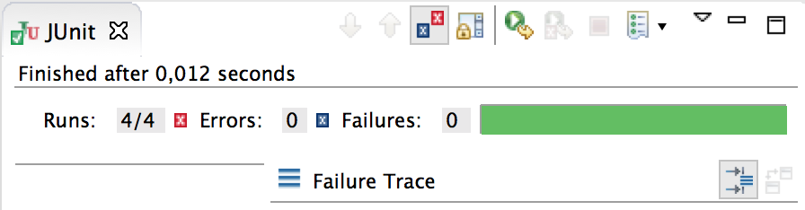

JUnit 
=

####[JUnit](junit.org) Unit Test Framework



```
import org.junit.Assert;
import org.junit.Test;
public class MorseJUnitTest {
    private MorseAlphabet ma = new MorseAlphabet();
    
    @Test
    public void testConvertString() {
        Assert.assertEquals("... --- ...", ma.convert("sos"));
        Assert.assertEquals("- . ... -", ma.convert("test"));
    }
}
```

extends TestCase:

```
import junit.framework.TestCase;
public class TestingJUnit extends TestCase {
    
    private RadioAlphabet radioAlphabet;
    
    @Override
    protected void setUp() throws Exception {
        super.setUp();
        radioAlphabet = new RadioAlphabet("alfa-hotel-zulu", "-");
        radioAlphabet.setWord("hotel alfa lima lima victor alfa romeo delta",
                " ");
    }
    
    public void testConvertChar() {
        assertEquals("alfa", radioAlphabet.convert('a'));
        assertEquals("hotel", radioAlphabet.convert('h'));
        assertEquals("zulu", radioAlphabet.convert('z'));
        assertNull(radioAlphabet.convert('!'));
    }
...

```

----

Map
=

A map keeps associations between key and value objects.
(a map is a function from one set, the key set, to another set, the value set. Every key in the map has a unique value, but a value may be associated with several keys.

HashMap: keys are in random order; more efficient in general.
``` 
public class RadioAlphabet {
    
    private Map<String, String> alphabet = new HashMap<String, String>();
    
        alphabet.put("a", "alfa");
        alphabet.put("b", "bravo");
        alphabet.put("c", "charlie");
        alphabet.put("d", "delta");
        alphabet.put("e", "echo");
        alphabet.put("f", "foxtrot");

    public String toString() {
        String s = "";
        Set<String> keySet = alphabet.keySet();
        for (String key : keySet) {
            s += key + ": " + alphabet.get(key) + "\n";
        }
        return s;
    }
}
```
TreeMap: keys are sorted order.

---

Enum 
-

```
public enum Month {

    January(31), February(28), March(31), April(30), May(31), June(30), July(31), August(
            31), September(30), October(31), November(30), December(31);
    
    private int value;
    
    private Month(int value) {
        this.value = value;
    }
    
    public int getValue() {
        return value;
    }
}
```

```
    /**
     * 29
     * if year is not divisible by 4 then common year
     * else if year is not divisible by 100 then leap year
     * else if year is not divisible by 400 then common year
     * else leap year
     */
    public boolean isLeapYear() {
        if (getYear() % 4 != 0) {
            return false;
        } else if (getYear() % 100 != 0) {
            return true;
        } else if (getYear() % 400 != 0) {
            return false;
        } else {
            return true;
        }
    }
```
